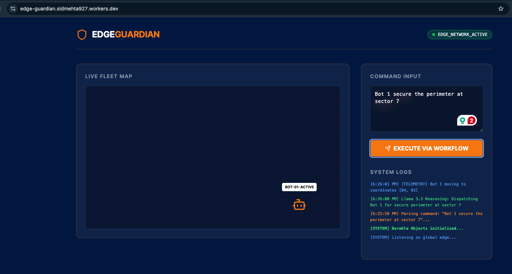
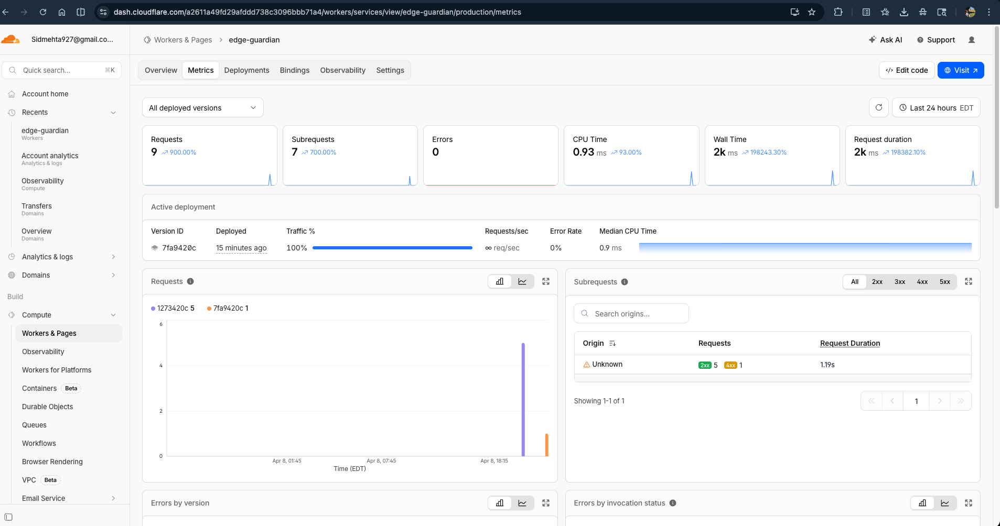

# cf_ai_edge-guardian 🛡️

**A Distributed Multi-Agent Robotics Control System built entirely on the Cloudflare Edge.**

[](https://edge-guardian.sidmehta927.workers.dev/)

## 📖 The Vision

In traditional physical AI and robotics, fleet intelligence is often centralized in a single GPU cluster. This creates massive single points of failure and introduces severe network latency. 

**Edge-Guardian** explores a cloud-native alternative: What if we offload robot intelligence and state management to the global edge? By utilizing Cloudflare's serverless primitives, we can create a zero-latency "Digital Twin" for every physical robot, orchestrate complex missions with built-in resilience, and parse natural language commands at the edge.




## 🏗️ Architecture & Cloudflare Stack

This project was built to specifically demonstrate the interoperability of Cloudflare's developer platform:

* **Brain / Reasoning (Workers AI):** Utilizes `Llama 3.3` to perform semantic extraction, translating messy human commands (e.g., *"Bot 1, secure the perimeter at sector 4"*) into strict, typed JSON actions.
* **State Management (Durable Objects):** Acts as the transactional consistency layer. Each robot is assigned a globally unique `RobotAgent` Durable Object. This ensures that even if a physical robot loses connection, its "Digital Twin" at the edge retains its exact last-known state, preventing conflicting commands.
* **Coordination (Workflows):** Physical operations take time and are prone to failure. `MissionWorkflow` orchestrates multi-step, asynchronous tasks (like a robot driving across a facility) with built-in step-level `.sleep()` and retry logic, proving resilience against network drops.
* **Frontend (Assets):** A full UI served seamlessly alongside the Worker, utilizing Tailwind CSS and dynamic DOM updates to simulate a real-time Command Center.

## 🚀 Running the Project

### Try the Live Deployment
1. Visit the live dashboard: `https://edge-guardian.sidmehta927.workers.dev/`
2. Enter a natural language command into the console, such as: `Send Bot 1 to inspect the chemical spill in Sector 7`.
3. Watch the system logs intercept the command, run it through Llama 3.3 for reasoning, extract the JSON payload, and simulate the Workflow dispatch.

### Run Locally

To run this project on your local machine, ensure you have Node.js installed, then follow these steps:

1. **Clone the repository:**
   ```bash
   git clone [https://github.com/yourusername/cf_ai_edge-guardian.git](https://github.com/yourusername/cf_ai_edge-guardian.git)
   cd cf_ai_edge-guardian

2. **Install Dependencies**
    ```bash
    npm install

3. **Authenticate with CloudFlare**
    ```bash
    npx wrangler login

4. **Start the local development server:**
    ```bash
    npx wrangler dev

The application will be available at http://localhost:8787.

